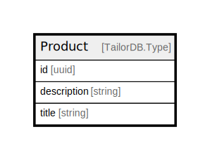

# Product

## Description

Product data schema

## Columns

| Name | Type | Default | Nullable | Children | Parents | Comment |
| ---- | ---- | ------- | -------- | -------- | ------- | ------- |
| id | uuid |  | false |  |  |  |
| description | string |  | false |  |  | Description of the product |
| title | string |  | false |  |  | Title of the product |

## Indexes

| Name | Definition |
| ---- | ---------- |
| Index for title | Index: true |

## Relations

---

> Generated by [tbls](https://github.com/k1LoW/tbls)
