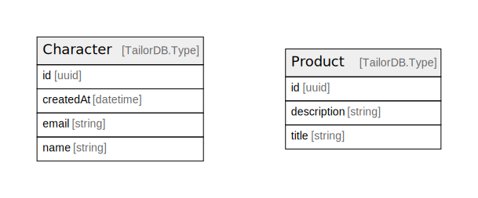

# 

## Tables

| Name | Columns | Comment | Type |
| ---- | ------- | ------- | ---- |
| [Character](Character.md) | 4 | Character data schema | TailorDB.Type |
| [Product](Product.md) | 3 | Product data schema | TailorDB.Type |

## Relations

---

> Generated by [tbls](https://github.com/k1LoW/tbls)
