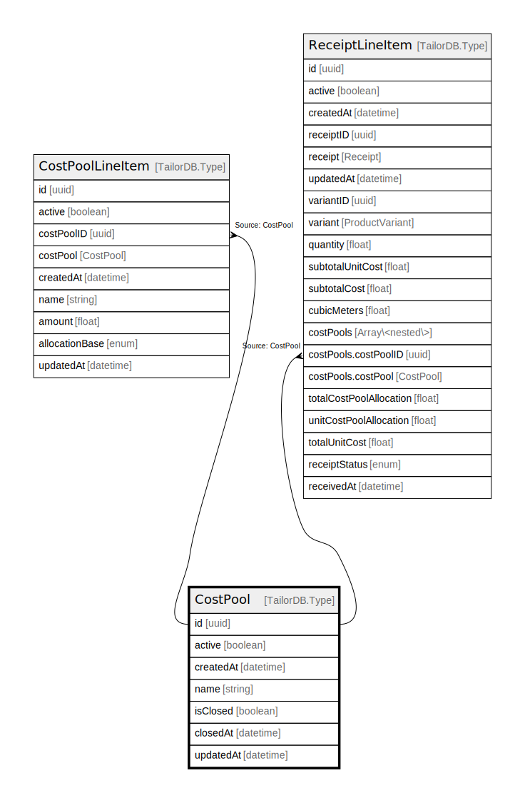

# CostPool

## Description

CostPool model

## Columns

| Name | Type | Default | Nullable | Children | Parents | Comment |
| ---- | ---- | ------- | -------- | -------- | ------- | ------- |
| id | uuid |  | false | [CostPoolLineItem](CostPoolLineItem.md) [ReceiptLineItem](ReceiptLineItem.md) |  |  |
| active | boolean |  | true |  |  | active |
| createdAt | datetime |  | true |  |  | createdAt |
| name | string |  | false |  |  | name |
| isClosed | boolean |  | true |  |  | isClosed |
| closedAt | datetime |  | true |  |  | closedAt |
| updatedAt | datetime |  | true |  |  | updatedAt |

## Indexes

| Name | Definition |
| ---- | ---------- |
| Index for createdAt | Index: true |
| Index for updatedAt | Index: true |

## Relations

---

> Generated by [tbls](https://github.com/k1LoW/tbls)
