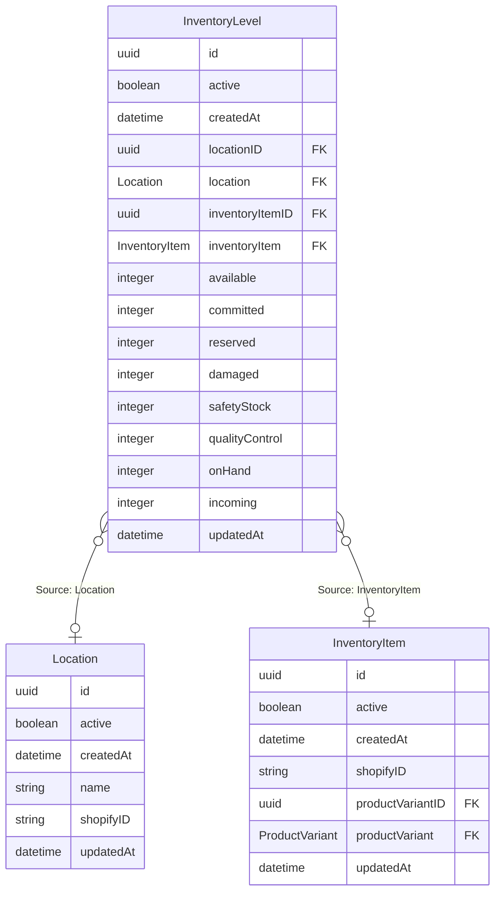

# InventoryLevel

## Description

Inventory Level of an inventory item

## Columns

| Name | Type | Default | Nullable | Children | Parents | Comment |
| ---- | ---- | ------- | -------- | -------- | ------- | ------- |
| id | uuid |  | false |  |  |  |
| active | boolean |  | true |  |  | active |
| createdAt | datetime |  | true |  |  | createdAt |
| locationID | uuid |  | true |  | [Location](Location.md) | Inventory Location ID |
| location | Location |  | true |  | [Location](Location.md) | Inventory Location |
| inventoryItemID | uuid |  | true |  | [InventoryItem](InventoryItem.md) | Inventory Item ID |
| inventoryItem | InventoryItem |  | true |  | [InventoryItem](InventoryItem.md) | Inventory Item |
| available | integer |  | true |  |  | Amount of the inventory item available |
| committed | integer |  | true |  |  | Amount of the inventory item reserved |
| reserved | integer |  | true |  |  | Amount of the inventory item reserved |
| damaged | integer |  | true |  |  | Amount of the inventory item damaged |
| safetyStock | integer |  | true |  |  | Amount of the inventory item safety stock |
| qualityControl | integer |  | true |  |  | Amount of the inventory item in quality control |
| onHand | integer |  | true |  |  | Amount of the inventory item on hand |
| incoming | integer |  | true |  |  | Amount of the inventory item incoming |
| updatedAt | datetime |  | true |  |  | updatedAt |

## Indexes

| Name | Definition |
| ---- | ---------- |
| Index for createdAt | Index: true |
| Index for updatedAt | Index: true |

## Relations

---

> Generated by [tbls](https://github.com/k1LoW/tbls)
