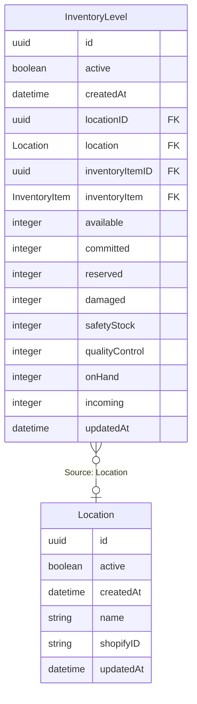

# Location

## Description

Inventory location on Shopify

## Columns

| Name | Type | Default | Nullable | Children | Parents | Comment |
| ---- | ---- | ------- | -------- | -------- | ------- | ------- |
| id | uuid |  | false | [InventoryLevel](InventoryLevel.md) |  |  |
| active | boolean |  | true |  |  | active |
| createdAt | datetime |  | true |  |  | createdAt |
| name | string |  | true |  |  | Name of the location |
| shopifyID | string |  | true |  |  | Shopify ID of the location |
| updatedAt | datetime |  | true |  |  | updatedAt |

## Indexes

| Name | Definition |
| ---- | ---------- |
| Index for createdAt | Index: true |
| Index for updatedAt | Index: true |

## Relations

---

> Generated by [tbls](https://github.com/k1LoW/tbls)
