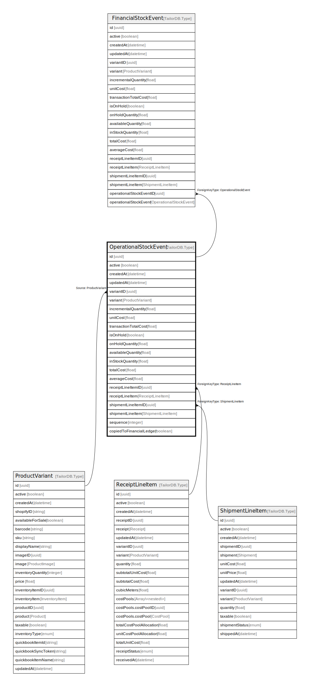

# OperationalStockEvent

## Description

OperationalStockEvent model. Holds the stock event data that can change.

## Columns

| Name | Type | Default | Nullable | Children | Parents | Comment |
| ---- | ---- | ------- | -------- | -------- | ------- | ------- |
| id | uuid |  | false | [FinancialStockEvent](FinancialStockEvent.md) |  |  |
| active | boolean |  | true |  |  | active |
| createdAt | datetime |  | true |  |  | createdAt |
| updatedAt | datetime |  | true |  |  | updatedAt |
| variantID | uuid |  | false |  | [ProductVariant](ProductVariant.md) | Variant ID |
| variant | ProductVariant |  | true |  | [ProductVariant](ProductVariant.md) | Variant |
| incrementalQuantity | float |  | false |  |  | incrementalQuantity |
| unitCost | float |  | false |  |  | unitCost |
| transactionTotalCost | float |  | true |  |  | transactionTotalCost |
| isOnHold | boolean |  | false |  |  | isOnHold |
| onHoldQuantity | float |  | true |  |  | DO NOT UPDATE FROM THE FRONT END. Quantity of the product that is on hold. |
| availableQuantity | float |  | true |  |  | DO NOT UPDATE FROM THE FRONT END. Available for sale quantity. |
| inStockQuantity | float |  | true |  |  | DO NOT UPDATE FROM THE FRONT END. The quantity of the product in stock. |
| totalCost | float |  | true |  |  | DO NOT UPDATE FROM THE FRONT END, use calculateStockEventAndUpdateStockSummary pipeline instead. Total cost of the product at the time of the event |
| averageCost | float |  | true |  |  | DO NOT UPDATE FROM THE FRONT END, use calculateStockEventAndUpdateStockSummary pipeline instead. Average cost of the product at the time of the event |
| receiptLineItemID | uuid |  | true |  | [ReceiptLineItem](ReceiptLineItem.md) | ReceiptLineItem where the StockEvent come from |
| receiptLineItem | ReceiptLineItem |  | true |  | [ReceiptLineItem](ReceiptLineItem.md) | ReceiptLineItem model. ReceiptLineItem and this model is 1:1. One stock event is only related o either one receipt or shipment |
| shipmentLineItemID | uuid |  | true |  | [ShipmentLineItem](ShipmentLineItem.md) | Shipment where the StockEvents come from |
| shipmentLineItem | ShipmentLineItem |  | true |  | [ShipmentLineItem](ShipmentLineItem.md) | ShipmentLineItem model. ShipmentLineItem and this model is 1:1. One stock event is only related o either one receipt or shipment. |
| sequence | integer |  | true |  |  | DO NOT UPDATE FROM THE FRONT END. Sequence of the stock event. |
| copiedToFinancialLedger | boolean |  | true |  |  | DO NOT UPDATE FROM THE FRONT END. If the stock event is copied to the financial ledger. |

## Constraints

| Name | Type | Definition |
| ---- | ---- | ---------- |
| ForeignKey for receiptLineItem to ReceiptLineItem | FOREIGN KEY | ForeignKeyType: ReceiptLineItem |
| ForeignKey for shipmentLineItem to ShipmentLineItem | FOREIGN KEY | ForeignKeyType: ShipmentLineItem |

## Indexes

| Name | Definition |
| ---- | ---------- |
| Index for createdAt | Index: true |
| Index for updatedAt | Index: true |

## Relations

---

> Generated by [tbls](https://github.com/k1LoW/tbls)
