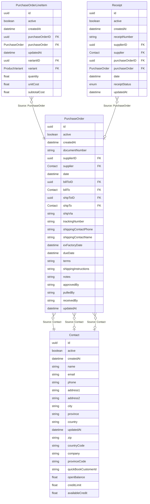

# PurchaseOrder

## Description

PurchaseOrder model

## Columns

| Name | Type | Default | Nullable | Children | Parents | Comment |
| ---- | ---- | ------- | -------- | -------- | ------- | ------- |
| id | uuid |  | false | [PurchaseOrderLineItem](PurchaseOrderLineItem.md) [Receipt](Receipt.md) |  |  |
| active | boolean |  | true |  |  | active |
| createdAt | datetime |  | true |  |  | createdAt |
| documentNumber | string |  | false |  |  | documentNumber |
| supplierID | uuid |  | false |  | [Contact](Contact.md) | supplier ID |
| supplier | Contact |  | true |  | [Contact](Contact.md) | Contact model. Contact and this model is n:1. |
| date | datetime |  | true |  |  | date |
| billToID | uuid |  | true |  | [Contact](Contact.md) | billTo ID |
| billTo | Contact |  | true |  | [Contact](Contact.md) | Contact model. Contact and this model is n:1. |
| shipToID | uuid |  | true |  | [Contact](Contact.md) | shipTo ID |
| shipTo | Contact |  | true |  | [Contact](Contact.md) | Contact model. Contact and this model is n:1. |
| shipVia | string |  | true |  |  | shipVia |
| trackingNumber | string |  | true |  |  | trackingNumber |
| shippingContactPhone | string |  | true |  |  | shippingContactPhone |
| shippingContactName | string |  | true |  |  | shippingContactName |
| exFactoryDate | datetime |  | true |  |  | exFactoryDate |
| dueDate | datetime |  | true |  |  | dueDate |
| terms | string |  | true |  |  | terms |
| shippingInstructions | string |  | true |  |  | shippingInstructions |
| notes | string |  | true |  |  | notes |
| approvedBy | string |  | true |  |  | approvedBy |
| pulledBy | string |  | true |  |  | pulledBy |
| receivedBy | string |  | true |  |  | receivedBy |
| updatedAt | datetime |  | true |  |  | updatedAt |

## Indexes

| Name | Definition |
| ---- | ---------- |
| Index for createdAt | Index: true |
| Index for updatedAt | Index: true |

## Relations

---

> Generated by [tbls](https://github.com/k1LoW/tbls)
