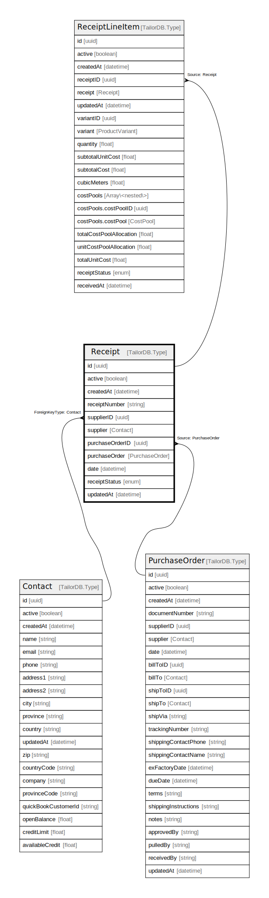

# Receipt

## Description

Receipt model

## Columns

| Name | Type | Default | Nullable | Children | Parents | Comment |
| ---- | ---- | ------- | -------- | -------- | ------- | ------- |
| id | uuid |  | false | [ReceiptLineItem](ReceiptLineItem.md) |  |  |
| active | boolean |  | true |  |  | active |
| createdAt | datetime |  | true |  |  | createdAt |
| receiptNumber | string |  | true |  |  | Receipt number |
| supplierID | uuid |  | true |  | [Contact](Contact.md) | Supplier ID |
| supplier | Contact |  | true |  | [Contact](Contact.md) | Supplier model. Supplier and this model is n:1. |
| purchaseOrderID | uuid |  | true |  | [PurchaseOrder](PurchaseOrder.md) | purchaseOrder ID |
| purchaseOrder | PurchaseOrder |  | true |  | [PurchaseOrder](PurchaseOrder.md) | PurchaseOrder model. PurchaseOrder and this model is n:1. |
| date | datetime |  | true |  |  | date |
| receiptStatus | enum |  | true |  |  | inventoryType |
| updatedAt | datetime |  | true |  |  | updatedAt |

## Constraints

| Name | Type | Definition |
| ---- | ---- | ---------- |
| ForeignKey for supplier to Contact | FOREIGN KEY | ForeignKeyType: Contact |

## Indexes

| Name | Definition |
| ---- | ---------- |
| Index for createdAt | Index: true |
| Index for updatedAt | Index: true |

## Relations

---

> Generated by [tbls](https://github.com/k1LoW/tbls)
