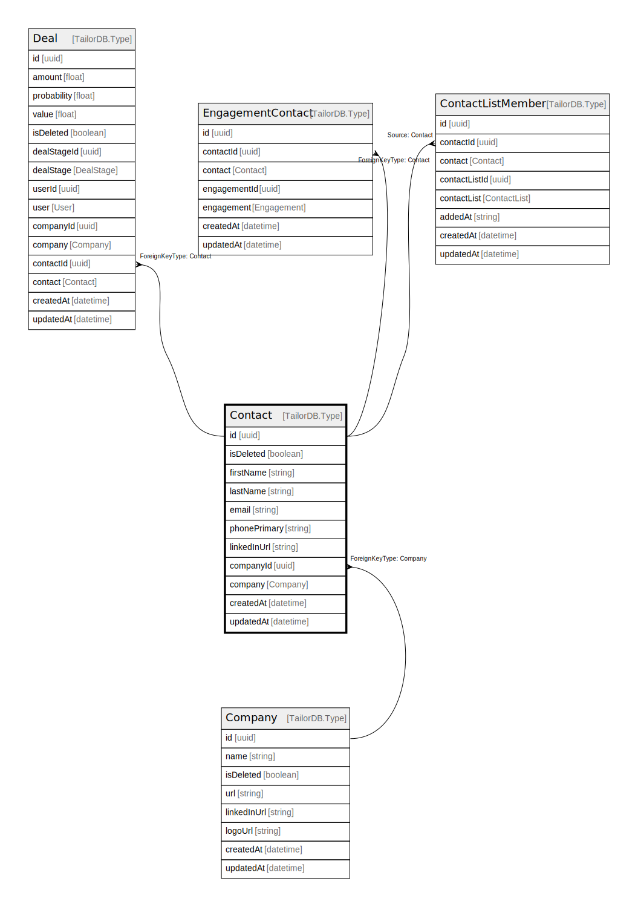

# Contact

## Description

Contact Model

## Columns

| Name | Type | Default | Nullable | Children | Parents | Comment |
| ---- | ---- | ------- | -------- | -------- | ------- | ------- |
| id | uuid |  | false | [ContactListMember](ContactListMember.md) [Deal](Deal.md) [EngagementContact](EngagementContact.md) |  |  |
| linkedInUrl | string |  | true |  |  | LinkedIn URL |
| createdAt | datetime |  | true |  |  | createdAt |
| updatedAt | datetime |  | true |  |  | updatedAt |
| isDeleted | boolean |  | true |  |  | Is Deleted? |
| firstName | string |  | false |  |  | First Name of the Contact |
| lastName | string |  | true |  |  | Last Name of the Contact |
| email | string |  | false |  |  | E-mail |
| phonePrimary | string |  | false |  |  | Primary Phone Number |
| companyId | uuid |  | false |  | [Company](Company.md) | Company ID |
| company | Company |  | true |  | [Company](Company.md) | Link to the Company |

## Constraints

| Name | Type | Definition |
| ---- | ---- | ---------- |
| ForeignKey for company to Company | FOREIGN KEY | ForeignKeyType: Company |

## Indexes

| Name | Definition |
| ---- | ---------- |
| Index for createdAt | Index: true |
| Index for updatedAt | Index: true |

## Relations

---

> Generated by [tbls](https://github.com/k1LoW/tbls)
