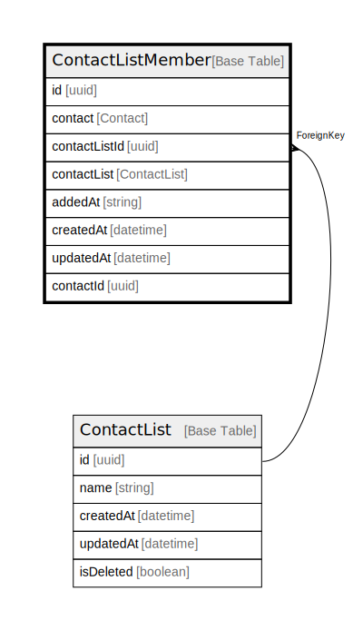

# ContactListMember

## Description

ContactListMember model

## Columns

| Name | Type | Default | Nullable | Children | Parents | Comment |
| ---- | ---- | ------- | -------- | -------- | ------- | ------- |
| id | uuid |  | false |  |  |  |
| contactListId | uuid |  | false |  | [ContactList](ContactList.md) | ContactList ID |
| contactList | ContactList |  | true |  |  | Link to the ContactList |
| addedAt | string |  | true |  |  | Time when the contact was added to the list |
| createdAt | datetime |  | true |  |  | createdAt |
| updatedAt | datetime |  | true |  |  | updatedAt |
| contactId | uuid |  | false |  |  | Contact ID |
| contact | Contact |  | true |  |  | Link to the Contact |

## Constraints

| Name | Type | Definition |
| ---- | ---- | ---------- |
|  | UNIQUE | {"contactListCompositeKey":{"FieldNames":["contactId","contactListId"],"Unique":true}} |
|  | FOREIGN KEY | ForeignKeyType: ContactList |

## Indexes

| Name | Definition |
| ---- | ---------- |
| contactListCompositeKey | {"contactListCompositeKey":{"FieldNames":["contactId","contactListId"],"Unique":true}} |
| Index for createdAt | Index: true |
| Index for updatedAt | Index: true |

## Relations

---

> Generated by [tbls](https://github.com/k1LoW/tbls)
