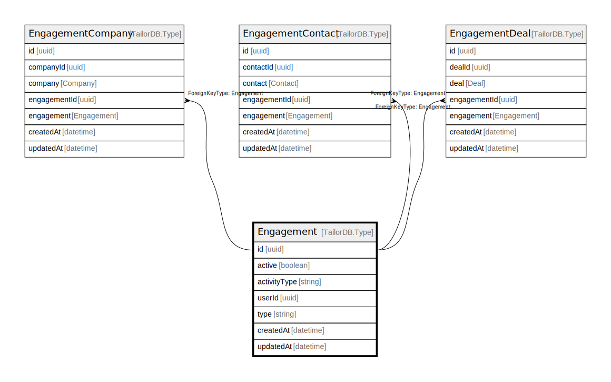

# Engagement

## Description

Engagement model

## Columns

| Name | Type | Default | Nullable | Children | Parents | Comment |
| ---- | ---- | ------- | -------- | -------- | ------- | ------- |
| id | uuid |  | false | [EngagementCompany](EngagementCompany.md) [EngagementContact](EngagementContact.md) [EngagementDeal](EngagementDeal.md) |  |  |
| activityType | string |  | false |  |  | Activity type |
| userId | uuid |  | false |  | [User](User.md) | Owner ID |
| type | string |  | true |  |  | Engagement type |
| createdAt | datetime |  | true |  |  | createdAt |
| updatedAt | datetime |  | true |  |  | updatedAt |
| active | boolean |  | true |  |  | Is active? |

## Constraints

| Name | Type | Definition |
| ---- | ---- | ---------- |
|  | FOREIGN KEY | ForeignKeyType: User |

## Indexes

| Name | Definition |
| ---- | ---------- |
| Index for createdAt | Index: true |
| Index for updatedAt | Index: true |

## Relations

---

> Generated by [tbls](https://github.com/k1LoW/tbls)
