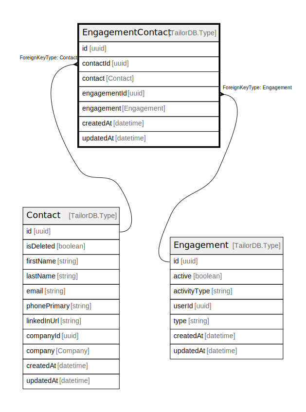

# EngagementContact

## Description

EngagementContact model

## Columns

| Name | Type | Default | Nullable | Children | Parents | Comment |
| ---- | ---- | ------- | -------- | -------- | ------- | ------- |
| id | uuid |  | false |  |  |  |
| createdAt | datetime |  | true |  |  | createdAt |
| updatedAt | datetime |  | true |  |  | updatedAt |
| contactId | uuid |  | false |  | [Contact](Contact.md) | Contact ID |
| contact | Contact |  | true |  | [Contact](Contact.md) | Link to the Contact |
| engagementId | uuid |  | false |  | [Engagement](Engagement.md) | Engagement ID |
| engagement | Engagement |  | true |  | [Engagement](Engagement.md) | Link to the Engagement |

## Constraints

| Name | Type | Definition |
| ---- | ---- | ---------- |
| engagementContactCompositeKey | UNIQUE | {"engagementContactCompositeKey":{"FieldNames":["contactId","engagementId"],"Unique":true}} |
| ForeignKey for contact to Contact | FOREIGN KEY | ForeignKeyType: Contact |
| ForeignKey for engagement to Engagement | FOREIGN KEY | ForeignKeyType: Engagement |

## Indexes

| Name | Definition |
| ---- | ---------- |
| engagementContactCompositeKey | {"engagementContactCompositeKey":{"FieldNames":["contactId","engagementId"],"Unique":true}} |
| Index for createdAt | Index: true |
| Index for updatedAt | Index: true |

## Relations

---

> Generated by [tbls](https://github.com/k1LoW/tbls)
