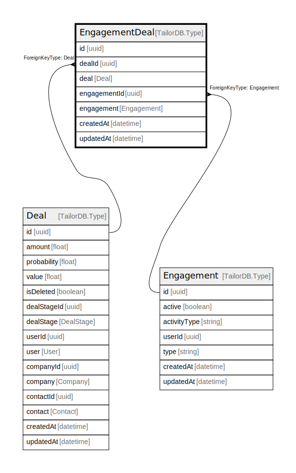

# EngagementDeal

## Description

EngagementDeal model

## Columns

| Name | Type | Default | Nullable | Children | Parents | Comment |
| ---- | ---- | ------- | -------- | -------- | ------- | ------- |
| id | uuid |  | false |  |  |  |
| engagementId | uuid |  | false |  | [Engagement](Engagement.md) | Engagement ID |
| engagement | Engagement |  | true |  |  | Link to the Engagement |
| createdAt | datetime |  | true |  |  | createdAt |
| updatedAt | datetime |  | true |  |  | updatedAt |
| dealId | uuid |  | false |  | [Deal](Deal.md) | Deal ID |
| deal | Deal |  | true |  |  | Link to the Deal |

## Constraints

| Name | Type | Definition |
| ---- | ---- | ---------- |
|  | UNIQUE | {"engagementDealCompositeKey":{"FieldNames":["dealId","engagementId"],"Unique":true}} |
|  | FOREIGN KEY | ForeignKeyType: Engagement |
|  | FOREIGN KEY | ForeignKeyType: Deal |

## Indexes

| Name | Definition |
| ---- | ---------- |
| engagementDealCompositeKey | {"engagementDealCompositeKey":{"FieldNames":["dealId","engagementId"],"Unique":true}} |
| Index for createdAt | Index: true |
| Index for updatedAt | Index: true |

## Relations

---

> Generated by [tbls](https://github.com/k1LoW/tbls)
