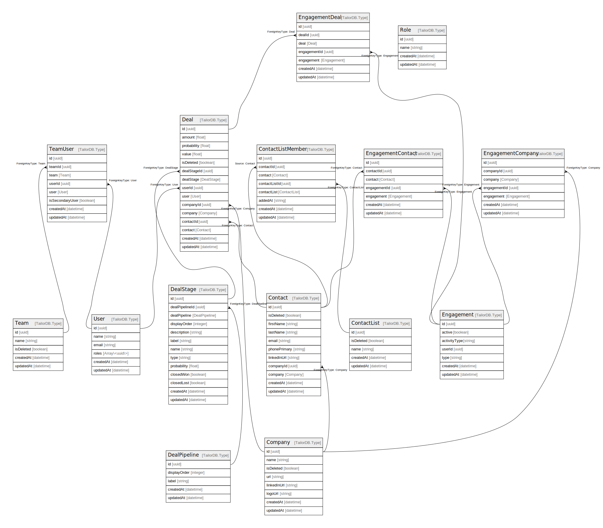

# crm

## Tables

| Name | Columns | Comment | Type |
| ---- | ------- | ------- | ---- |
| [Company](Company.md) | 8 | Company Model | Base Table |
| [Contact](Contact.md) | 11 | Contact Model | Base Table |
| [ContactList](ContactList.md) | 5 | ContactList model | Base Table |
| [ContactListMember](ContactListMember.md) | 8 | ContactListMember model | Base Table |
| [Deal](Deal.md) | 15 | Deal description | Base Table |
| [DealPipeline](DealPipeline.md) | 5 | DealPipeline description | Base Table |
| [DealStage](DealStage.md) | 13 | DealStage model | Base Table |
| [Engagement](Engagement.md) | 7 | Engagement model | Base Table |
| [EngagementCompany](EngagementCompany.md) | 7 | EngagementCompany model | Base Table |
| [EngagementContact](EngagementContact.md) | 7 | EngagementContact model | Base Table |
| [EngagementDeal](EngagementDeal.md) | 7 | EngagementDeal model | Base Table |
| [Role](Role.md) | 4 | User Roles | Base Table |
| [Team](Team.md) | 5 | Team model | Base Table |
| [TeamUser](TeamUser.md) | 8 | TeamUser model | Base Table |
| [User](User.md) | 6 | User of the system | Base Table |

## Relations

---

> Generated by [tbls](https://github.com/k1LoW/tbls)
