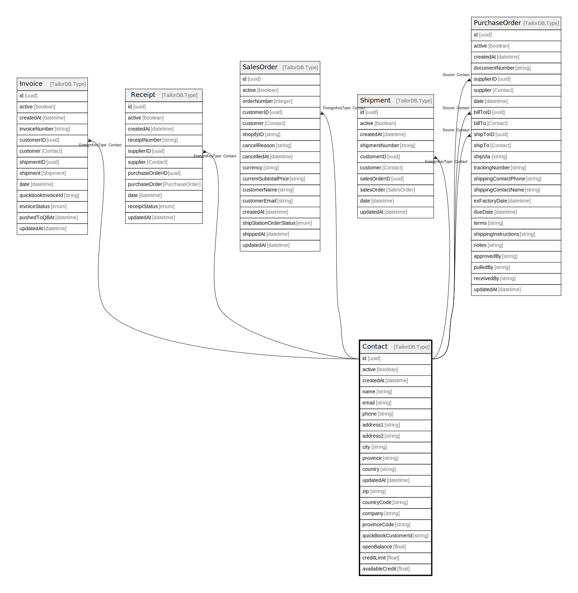

# Contact

## Description

Contact model

## Columns

| Name | Type | Default | Nullable | Children | Parents | Comment |
| ---- | ---- | ------- | -------- | -------- | ------- | ------- |
| id | uuid |  | false | [Invoice](Invoice.md) [PurchaseOrder](PurchaseOrder.md) [Receipt](Receipt.md) [SalesOrder](SalesOrder.md) [Shipment](Shipment.md) |  |  |
| openBalance | float |  | true |  |  | The amount of open balance of the customer. |
| city | string |  | true |  |  | city |
| province | string |  | true |  |  | province |
| updatedAt | datetime |  | true |  |  | updatedAt |
| country | string |  | true |  |  | country |
| zip | string |  | true |  |  | zip |
| provinceCode | string |  | true |  |  | province_code |
| creditLimit | float |  | true |  |  | The amount of credit limit of the customer. |
| active | boolean |  | true |  |  | active |
| name | string |  | false |  |  | name |
| email | string |  | false |  |  | email |
| countryCode | string |  | true |  |  | countryCode |
| company | string |  | true |  |  | company |
| quickBookCustomerId | string |  | true |  |  | the reference id of the customer in quickbook |
| address2 | string |  | true |  |  | address2 |
| availableCredit | float |  | true |  |  | The amount of credit available to the customer. |
| createdAt | datetime |  | true |  |  | createdAt |
| phone | string |  | true |  |  | phone |
| address1 | string |  | true |  |  | address1 |

## Indexes

| Name | Definition |
| ---- | ---------- |
| Index for updatedAt | Index: true |
| Index for createdAt | Index: true |

## Relations

---

> Generated by [tbls](https://github.com/k1LoW/tbls)
