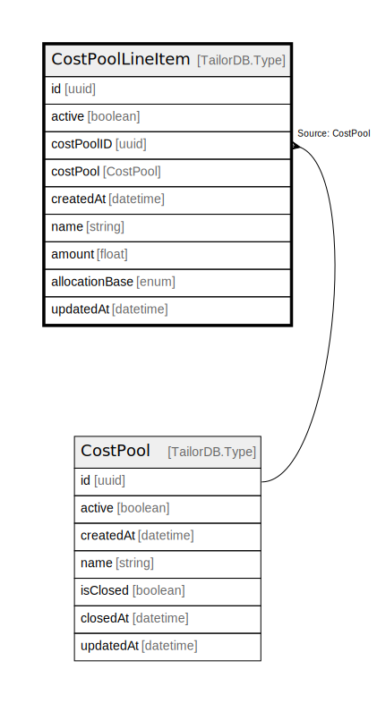

# CostPoolLineItem

## Description

CostPoolLineItem model

## Columns

| Name | Type | Default | Nullable | Children | Parents | Comment |
| ---- | ---- | ------- | -------- | -------- | ------- | ------- |
| id | uuid |  | false |  |  |  |
| updatedAt | datetime |  | true |  |  | updatedAt |
| active | boolean |  | true |  |  | active |
| costPoolID | uuid |  | false |  | [CostPool](CostPool.md) | costPool ID |
| costPool | CostPool |  | true |  | [CostPool](CostPool.md) | CostPool model. CostPool and this model is n:1. |
| createdAt | datetime |  | true |  |  | createdAt |
| name | string |  | false |  |  | name |
| amount | float |  | false |  |  | amount |
| allocationBase | enum |  | false |  |  | allocationBase |

## Indexes

| Name | Definition |
| ---- | ---------- |
| Index for updatedAt | Index: true |
| Index for createdAt | Index: true |

## Relations

---

> Generated by [tbls](https://github.com/k1LoW/tbls)
