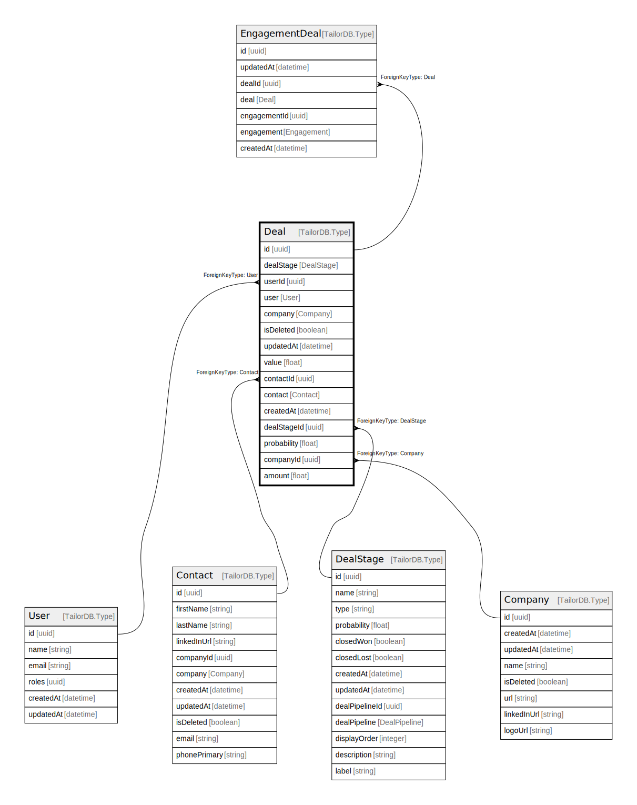

# Deal

## Description

Deal description

## Columns

| Name | Type | Default | Nullable | Children | Parents | Comment |
| ---- | ---- | ------- | -------- | -------- | ------- | ------- |
| id | uuid |  | false | [EngagementDeal](EngagementDeal.md) |  |  |
| dealStage | DealStage |  | true |  |  | Link to the DealStage |
| userId | uuid |  | false |  | [User](User.md) | User ID |
| user | User |  | true |  |  | Link to the User |
| company | Company |  | true |  |  | Link to the Company |
| isDeleted | boolean |  | true |  |  | Is Deleted? |
| updatedAt | datetime |  | true |  |  | updatedAt |
| value | float |  | true |  |  | Deal value |
| contactId | uuid |  | false |  | [Contact](Contact.md) | Contact ID |
| contact | Contact |  | true |  |  | Link to the Contact |
| createdAt | datetime |  | true |  |  | createdAt |
| dealStageId | uuid |  | false |  | [DealStage](DealStage.md) | DealStage ID |
| probability | float |  | false |  |  | Deal probability. |
| companyId | uuid |  | false |  | [Company](Company.md) | Company ID |
| amount | float |  | false |  |  | Deal amount |

## Constraints

| Name | Type | Definition |
| ---- | ---- | ---------- |
|  | FOREIGN KEY | ForeignKeyType: User |
|  | FOREIGN KEY | ForeignKeyType: Contact |
|  | FOREIGN KEY | ForeignKeyType: DealStage |
|  | FOREIGN KEY | ForeignKeyType: Company |

## Indexes

| Name | Definition |
| ---- | ---------- |
| Index for updatedAt | Index: true |
| Index for createdAt | Index: true |

## Relations

---

> Generated by [tbls](https://github.com/k1LoW/tbls)
