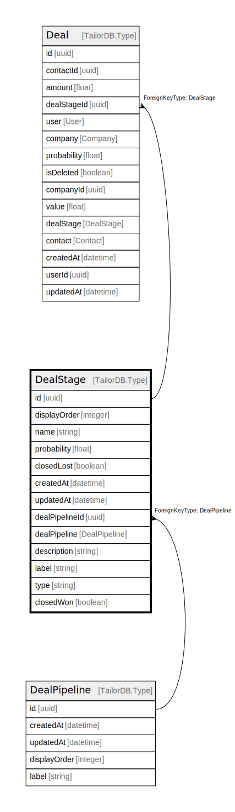

# DealStage

## Description

DealStage model

## Columns

| Name | Type | Default | Nullable | Children | Parents | Comment |
| ---- | ---- | ------- | -------- | -------- | ------- | ------- |
| id | uuid |  | false | [Deal](Deal.md) |  |  |
| dealPipelineId | uuid |  | false |  | [DealPipeline](DealPipeline.md) | DealPipeline ID |
| displayOrder | integer |  | false |  |  | Display Order |
| description | string |  | true |  |  | Description |
| type | string |  | true |  |  | Stage type |
| probability | float |  | false |  |  | Default probability |
| closedLost | boolean |  | false |  |  | Closed Lost? |
| createdAt | datetime |  | true |  |  | createdAt |
| dealPipeline | DealPipeline |  | true |  |  | Link to the DealPipeline |
| label | string |  | false |  |  | Label |
| name | string |  | false |  |  | Name |
| closedWon | boolean |  | false |  |  | Closed Won? |
| updatedAt | datetime |  | true |  |  | updatedAt |

## Constraints

| Name | Type | Definition |
| ---- | ---- | ---------- |
|  | FOREIGN KEY | ForeignKeyType: DealPipeline |

## Indexes

| Name | Definition |
| ---- | ---------- |
| Index for createdAt | Index: true |
| Index for updatedAt | Index: true |

## Relations

---

> Generated by [tbls](https://github.com/k1LoW/tbls)
