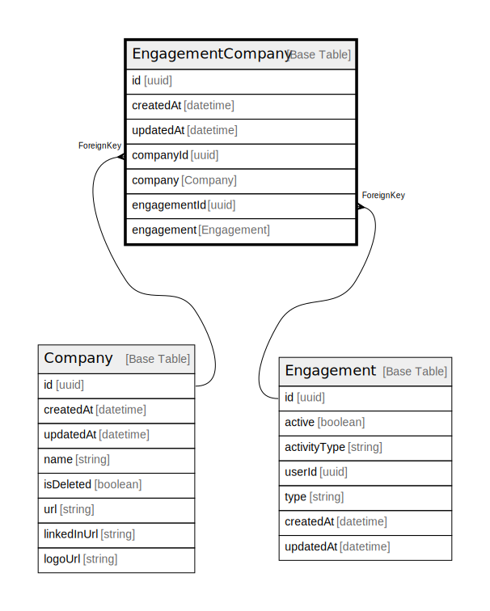

# EngagementCompany

## Description

EngagementCompany model

## Columns

| Name | Type | Default | Nullable | Children | Parents | Comment |
| ---- | ---- | ------- | -------- | -------- | ------- | ------- |
| id | uuid |  | false |  |  |  |
| createdAt | datetime |  | true |  |  | createdAt |
| updatedAt | datetime |  | true |  |  | updatedAt |
| companyId | uuid |  | false |  | [Company](Company.md) | Company ID |
| company | Company |  | true |  | [Company](Company.md) | Link to the Company |
| engagementId | uuid |  | false |  | [Engagement](Engagement.md) | Engagement ID |
| engagement | Engagement |  | true |  | [Engagement](Engagement.md) | Link to the Engagement |

## Constraints

| Name | Type | Definition |
| ---- | ---- | ---------- |
| engagementCompanyCompositeKey | UNIQUE | {"engagementCompanyCompositeKey":{"FieldNames":["companyId","engagementId"],"Unique":true}} |
| ForeignKey for company to Company | FOREIGN KEY | ForeignKeyType: Company |
| ForeignKey for engagement to Engagement | FOREIGN KEY | ForeignKeyType: Engagement |

## Indexes

| Name | Definition |
| ---- | ---------- |
| engagementCompanyCompositeKey | {"engagementCompanyCompositeKey":{"FieldNames":["companyId","engagementId"],"Unique":true}} |
| Index for createdAt | Index: true |
| Index for updatedAt | Index: true |

## Relations

---

> Generated by [tbls](https://github.com/k1LoW/tbls)
