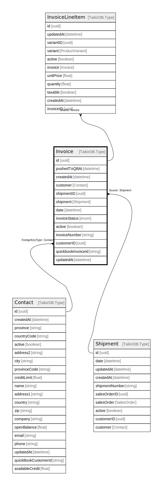

# Invoice

## Description

Invoice model

## Columns

| Name | Type | Default | Nullable | Children | Parents | Comment |
| ---- | ---- | ------- | -------- | -------- | ------- | ------- |
| id | uuid |  | false | [InvoiceLineItem](InvoiceLineItem.md) |  |  |
| shipment | Shipment |  | true |  | [Shipment](Shipment.md) | Shipment model. (Origin of the invoice) Shipment and this model is n:1. |
| updatedAt | datetime |  | true |  |  | updatedAt |
| createdAt | datetime |  | true |  |  | createdAt |
| customerID | uuid |  | true |  | [Contact](Contact.md) | Contact model. Contact and this model is n:1 |
| customer | Contact |  | true |  | [Contact](Contact.md) | Customer contact |
| date | datetime |  | true |  |  | date |
| quickbookInvoiceId | string |  | true |  |  | Quickbook invoice ID |
| invoiceStatus | enum |  | true |  |  | inventoryType |
| pushedToQBAt | datetime |  | true |  |  | Date when the invoice was pushed to QuickBooks |
| active | boolean |  | true |  |  | active |
| invoiceNumber | string |  | true |  |  | Invoice number |
| shipmentID | uuid |  | true |  | [Shipment](Shipment.md) | Shipment ID (Origin of the invoice) |

## Constraints

| Name | Type | Definition |
| ---- | ---- | ---------- |
| ForeignKey for customer to Contact | FOREIGN KEY | ForeignKeyType: Contact |

## Indexes

| Name | Definition |
| ---- | ---------- |
| Index for updatedAt | Index: true |
| Index for createdAt | Index: true |

## Relations

---

> Generated by [tbls](https://github.com/k1LoW/tbls)
