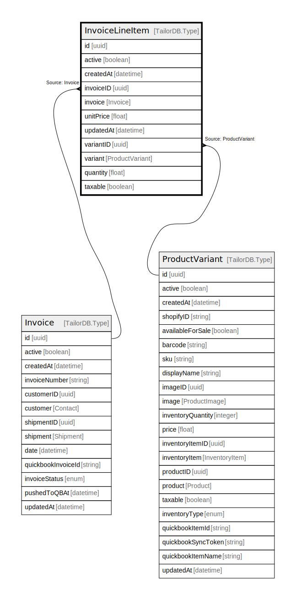

# InvoiceLineItem

## Description

InvoiceLineItem model

## Columns

| Name | Type | Default | Nullable | Children | Parents | Comment |
| ---- | ---- | ------- | -------- | -------- | ------- | ------- |
| id | uuid |  | false |  |  |  |
| active | boolean |  | true |  |  | active |
| invoice | Invoice |  | true |  | [Invoice](Invoice.md) | Invoice model. Invoice and this model is n:1. |
| quantity | float |  | false |  |  | quantity |
| taxable | boolean |  | true |  |  | taxable |
| createdAt | datetime |  | true |  |  | createdAt |
| invoiceID | uuid |  | false |  | [Invoice](Invoice.md) | Invoice ID |
| unitPrice | float |  | false |  |  | unit cost |
| updatedAt | datetime |  | true |  |  | updatedAt |
| variantID | uuid |  | true |  | [ProductVariant](ProductVariant.md) | Variant ID |
| variant | ProductVariant |  | true |  | [ProductVariant](ProductVariant.md) | Variant |

## Indexes

| Name | Definition |
| ---- | ---------- |
| Index for createdAt | Index: true |
| Index for updatedAt | Index: true |

## Relations

---

> Generated by [tbls](https://github.com/k1LoW/tbls)
