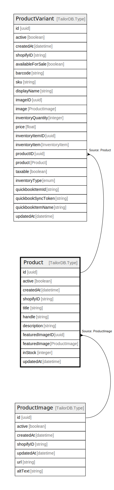

# Product

## Description

Product model

## Columns

| Name | Type | Default | Nullable | Children | Parents | Comment |
| ---- | ---- | ------- | -------- | -------- | ------- | ------- |
| id | uuid |  | false | [ProductVariant](ProductVariant.md) |  |  |
| active | boolean |  | true |  |  | active |
| createdAt | datetime |  | true |  |  | createdAt |
| title | string |  | true |  |  | Product title |
| updatedAt | datetime |  | true |  |  | updatedAt |
| inStock | integer |  | true |  |  | Quantity of the product |
| shopifyID | string |  | true |  |  | Shopify product ID |
| handle | string |  | true |  |  | Product handle |
| description | string |  | true |  |  | Product description |
| featuredImageID | uuid |  | true |  | [ProductImage](ProductImage.md) | Featured image ID |
| featuredImage | ProductImage |  | true |  | [ProductImage](ProductImage.md) | Featured image of the product |

## Indexes

| Name | Definition |
| ---- | ---------- |
| Index for createdAt | Index: true |
| Index for updatedAt | Index: true |

## Relations

---

> Generated by [tbls](https://github.com/k1LoW/tbls)
