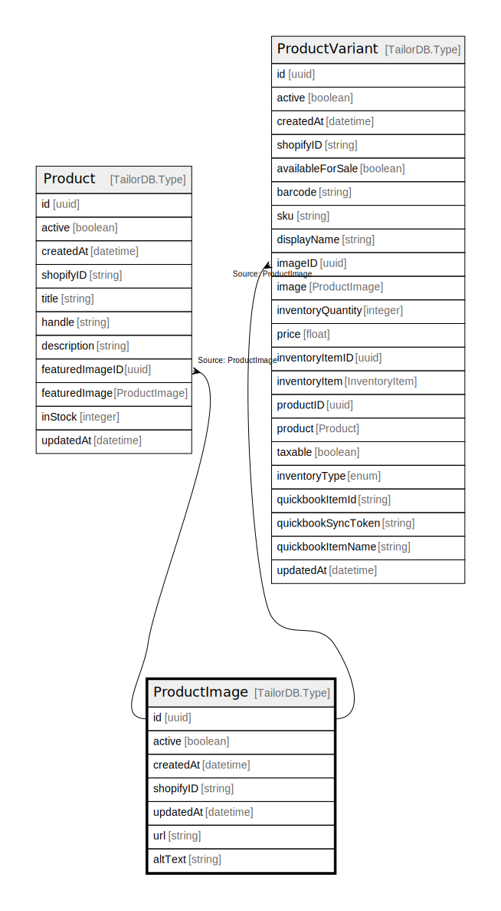

# ProductImage

## Description

Product Image

## Columns

| Name | Type | Default | Nullable | Children | Parents | Comment |
| ---- | ---- | ------- | -------- | -------- | ------- | ------- |
| id | uuid |  | false | [Product](Product.md) [ProductVariant](ProductVariant.md) |  |  |
| createdAt | datetime |  | true |  |  | createdAt |
| shopifyID | string |  | true |  |  | Shopify image ID |
| updatedAt | datetime |  | true |  |  | updatedAt |
| url | string |  | true |  |  | Image URL |
| altText | string |  | true |  |  | Alt text |
| active | boolean |  | true |  |  | active |

## Indexes

| Name | Definition |
| ---- | ---------- |
| Index for createdAt | Index: true |
| Index for updatedAt | Index: true |

## Relations

---

> Generated by [tbls](https://github.com/k1LoW/tbls)
