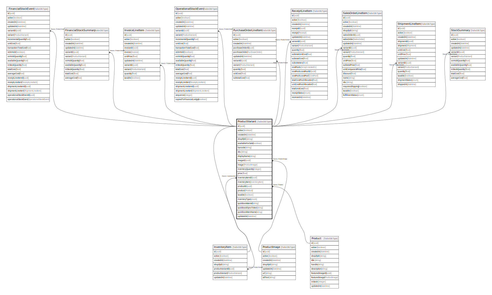

# ProductVariant

## Description

The variants of a product

## Columns

| Name | Type | Default | Nullable | Children | Parents | Comment |
| ---- | ---- | ------- | -------- | -------- | ------- | ------- |
| id | uuid |  | false | [FinancialStockEvent](FinancialStockEvent.md) [FinancialStockSummary](FinancialStockSummary.md) [InventoryItem](InventoryItem.md) [InvoiceLineItem](InvoiceLineItem.md) [OperationalStockEvent](OperationalStockEvent.md) [PurchaseOrderLineItem](PurchaseOrderLineItem.md) [ReceiptLineItem](ReceiptLineItem.md) [SalesOrderLineItem](SalesOrderLineItem.md) [ShipmentLineItem](ShipmentLineItem.md) [StockSummary](StockSummary.md) |  |  |
| shopifyID | string |  | true |  |  | Shopify product ID |
| availableForSale | boolean |  | true |  |  | Is the product available for sale |
| displayName | string |  | true |  |  | The display name of the product |
| price | float |  | true |  |  | The price of the product |
| product | Product |  | true |  | [Product](Product.md) | The product of the product variant |
| updatedAt | datetime |  | true |  |  | updatedAt |
| sku | string |  | true |  |  | The sku(Stock Keeping Unit) of the product |
| image | ProductImage |  | true |  | [ProductImage](ProductImage.md) | The image of the product variant |
| inventoryItem | InventoryItem |  | true |  | [InventoryItem](InventoryItem.md) | The inventory item of the product |
| inventoryType | enum |  | true |  |  | inventoryType |
| quickbookSyncToken | string |  | true |  |  | The quickbook sync token of the product |
| taxable | boolean |  | true |  |  | Is the product taxable |
| quickbookItemId | string |  | true |  |  | The quickbook item ID of the product |
| createdAt | datetime |  | true |  |  | createdAt |
| barcode | string |  | true |  |  | The barcode of the product |
| imageID | uuid |  | true |  | [ProductImage](ProductImage.md) | The image of the product variant |
| inventoryQuantity | integer |  | true |  |  | The inventory quantity of the product |
| productID | uuid |  | true |  | [Product](Product.md) | The product ID of the product variant |
| active | boolean |  | true |  |  | active |
| inventoryItemID | uuid |  | true |  | [InventoryItem](InventoryItem.md) | The inventory item ID of the product deprecated |
| quickbookItemName | string |  | true |  |  | The quickbook item name of the product |

## Indexes

| Name | Definition |
| ---- | ---------- |
| Index for updatedAt | Index: true |
| Index for createdAt | Index: true |

## Relations

---

> Generated by [tbls](https://github.com/k1LoW/tbls)
