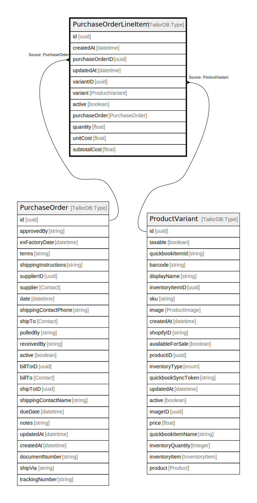

# PurchaseOrderLineItem

## Description

PurchaseOrderLineItem model

## Columns

| Name | Type | Default | Nullable | Children | Parents | Comment |
| ---- | ---- | ------- | -------- | -------- | ------- | ------- |
| id | uuid |  | false |  |  |  |
| createdAt | datetime |  | true |  |  | createdAt |
| purchaseOrderID | uuid |  | false |  | [PurchaseOrder](PurchaseOrder.md) | purchaseOrder ID |
| updatedAt | datetime |  | true |  |  | updatedAt |
| variantID | uuid |  | false |  | [ProductVariant](ProductVariant.md) | Variant ID |
| variant | ProductVariant |  | true |  | [ProductVariant](ProductVariant.md) | Variant |
| active | boolean |  | true |  |  | active |
| purchaseOrder | PurchaseOrder |  | true |  | [PurchaseOrder](PurchaseOrder.md) | PurchaseOrder model. PurchaseOrder and this model is n:1. |
| quantity | float |  | false |  |  | quantity |
| unitCost | float |  | false |  |  | unitCost |
| subtotalCost | float |  | true |  |  | subtotalCost |

## Indexes

| Name | Definition |
| ---- | ---------- |
| Index for createdAt | Index: true |
| Index for updatedAt | Index: true |

## Relations

---

> Generated by [tbls](https://github.com/k1LoW/tbls)
