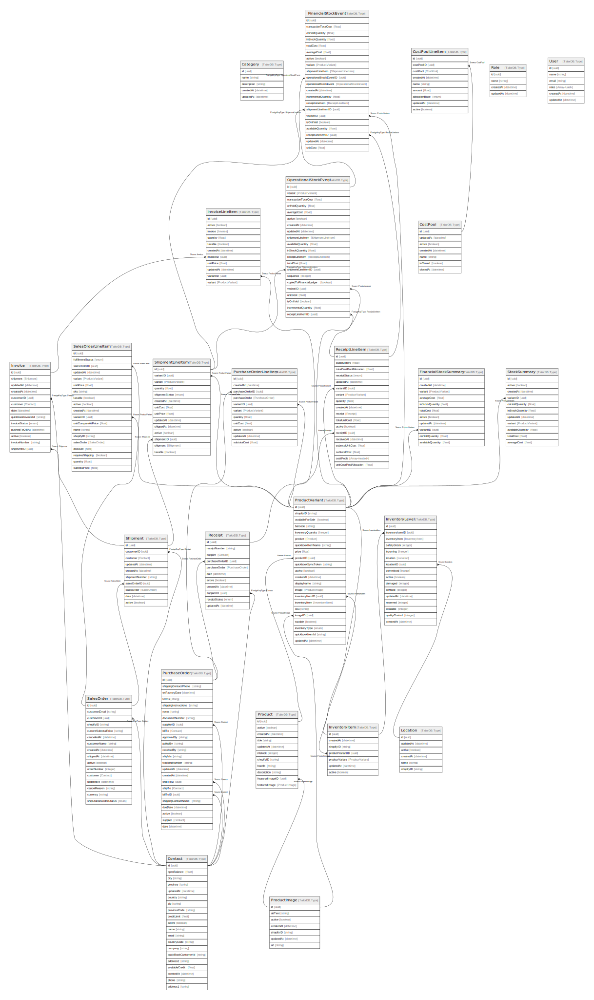

# ims

## Tables

| Name | Columns | Comment | Type |
| ---- | ------- | ------- | ---- |
| [Category](Category.md) | 5 | Contains information about categories of products. | TailorDB.Type |
| [Contact](Contact.md) | 20 | Contact model | TailorDB.Type |
| [CostPool](CostPool.md) | 7 | CostPool model | TailorDB.Type |
| [CostPoolLineItem](CostPoolLineItem.md) | 9 | CostPoolLineItem model | TailorDB.Type |
| [FinancialStockEvent](FinancialStockEvent.md) | 21 | DO NOT UPDATE FROM THE FRONT END. FinancialStockEvent model. Holds StockEvents that will not change anymore. | TailorDB.Type |
| [FinancialStockSummary](FinancialStockSummary.md) | 11 | StockSummary model for the financial ledger | TailorDB.Type |
| [InventoryItem](InventoryItem.md) | 7 | Product variant's inventory item model | TailorDB.Type |
| [InventoryLevel](InventoryLevel.md) | 16 | Inventory Level of an inventory item | TailorDB.Type |
| [Invoice](Invoice.md) | 13 | Invoice model | TailorDB.Type |
| [InvoiceLineItem](InvoiceLineItem.md) | 11 | InvoiceLineItem model | TailorDB.Type |
| [Location](Location.md) | 6 | Inventory location on Shopify | TailorDB.Type |
| [OperationalStockEvent](OperationalStockEvent.md) | 21 | OperationalStockEvent model. Holds the stock event data that can change. | TailorDB.Type |
| [Product](Product.md) | 11 | Product model | TailorDB.Type |
| [ProductImage](ProductImage.md) | 7 | Product Image | TailorDB.Type |
| [ProductVariant](ProductVariant.md) | 22 | The variants of a product | TailorDB.Type |
| [PurchaseOrder](PurchaseOrder.md) | 24 | PurchaseOrder model | TailorDB.Type |
| [PurchaseOrderLineItem](PurchaseOrderLineItem.md) | 11 | PurchaseOrderLineItem model | TailorDB.Type |
| [Receipt](Receipt.md) | 11 | Receipt model | TailorDB.Type |
| [ReceiptLineItem](ReceiptLineItem.md) | 18 | ReceiptLineItem model | TailorDB.Type |
| [Role](Role.md) | 4 | User Roles | TailorDB.Type |
| [SalesOrder](SalesOrder.md) | 16 | SalesOrder model | TailorDB.Type |
| [SalesOrderLineItem](SalesOrderLineItem.md) | 19 | SalesOrderLineItem model | TailorDB.Type |
| [Shipment](Shipment.md) | 10 | Shipment model | TailorDB.Type |
| [ShipmentLineItem](ShipmentLineItem.md) | 14 | ShipmentLineItem model | TailorDB.Type |
| [StockSummary](StockSummary.md) | 11 | StockSummary model | TailorDB.Type |
| [User](User.md) | 6 | User of the system | TailorDB.Type |

## Relations

---

> Generated by [tbls](https://github.com/k1LoW/tbls)
