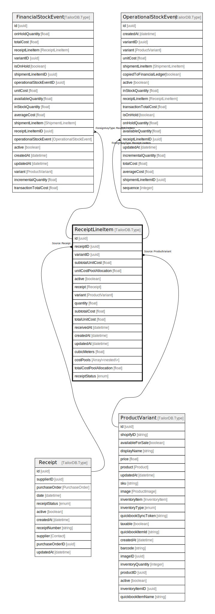

# ReceiptLineItem

## Description

ReceiptLineItem model

## Columns

| Name | Type | Default | Nullable | Extra Definition | Children | Parents | Comment |
| ---- | ---- | ------- | -------- | ---------------- | -------- | ------- | ------- |
| id | uuid |  | false |  | [FinancialStockEvent](FinancialStockEvent.md) [OperationalStockEvent](OperationalStockEvent.md) |  |  |
| receiptID | uuid |  | false |  |  | [Receipt](Receipt.md) | receipt ID |
| variantID | uuid |  | false |  |  | [ProductVariant](ProductVariant.md) | Variant ID |
| subtotalUnitCost | float |  | false |  |  |  | subtotalUnitCost |
| unitCostPoolAllocation | float |  | true |  |  |  | unitCostPoolAllocation |
| active | boolean |  | true |  |  |  | active |
| receipt | Receipt |  | true |  |  | [Receipt](Receipt.md) | Receipt model. Receipt and this model is n:1. |
| variant | ProductVariant |  | true |  |  | [ProductVariant](ProductVariant.md) | Variant |
| quantity | float |  | false |  |  |  | quantity |
| subtotalCost | float |  | true |  |  |  | subtotalCost |
| totalUnitCost | float |  | true |  |  |  | totalUnitCost |
| receivedAt | datetime |  | true |  |  |  | shipped at |
| createdAt | datetime |  | true |  |  |  | createdAt |
| updatedAt | datetime |  | true |  |  |  | updatedAt |
| cubicMeters | float |  | true |  |  |  | cubicMeters |
| costPools | Array\<nested\> |  | true | {"costPool":{"Type":"CostPool","Description":"CostPool model. CostPool and this model is n:n.","SourceId":"costPoolID"},"costPoolID":{"Type":"uuid","Description":"CostPool ID"}} |  |  | CostPool model. CostPool and this model is n:n. |
| totalCostPoolAllocation | float |  | true |  |  |  | totalCostPoolAllocation |
| receiptStatus | enum |  | true |  |  |  | inventoryType |

## Indexes

| Name | Definition |
| ---- | ---------- |
| Index for createdAt | Index: true |
| Index for updatedAt | Index: true |

## Relations

---

> Generated by [tbls](https://github.com/k1LoW/tbls)
