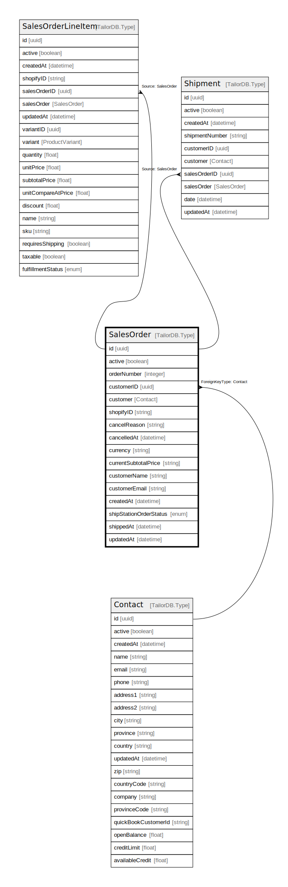

# SalesOrder

## Description

SalesOrder model

## Columns

| Name | Type | Default | Nullable | Children | Parents | Comment |
| ---- | ---- | ------- | -------- | -------- | ------- | ------- |
| id | uuid |  | false | [SalesOrderLineItem](SalesOrderLineItem.md) [Shipment](Shipment.md) |  |  |
| customerEmail | string |  | true |  |  | Customer email |
| customerID | uuid |  | true |  | [Contact](Contact.md) | Contact model. Contact and this model is n:1 |
| shopifyID | string |  | true |  |  | Shopify order ID |
| currentSubtotalPrice | string |  | true |  |  | Current subtotal price |
| cancelledAt | datetime |  | true |  |  | Cancellation date |
| customerName | string |  | true |  |  | Customer name |
| createdAt | datetime |  | true |  |  | createdAt |
| shippedAt | datetime |  | true |  |  | shipped at |
| active | boolean |  | true |  |  | active |
| orderNumber | integer |  | true |  |  | Order number |
| customer | Contact |  | true |  | [Contact](Contact.md) | Customer contact |
| updatedAt | datetime |  | true |  |  | updatedAt |
| cancelReason | string |  | true |  |  | Reason for cancellation |
| currency | string |  | true |  |  | Currency |
| shipStationOrderStatus | enum |  | true |  |  | inventoryType |

## Constraints

| Name | Type | Definition |
| ---- | ---- | ---------- |
| ForeignKey for customer to Contact | FOREIGN KEY | ForeignKeyType: Contact |

## Indexes

| Name | Definition |
| ---- | ---------- |
| Index for createdAt | Index: true |
| Index for updatedAt | Index: true |

## Relations

---

> Generated by [tbls](https://github.com/k1LoW/tbls)
