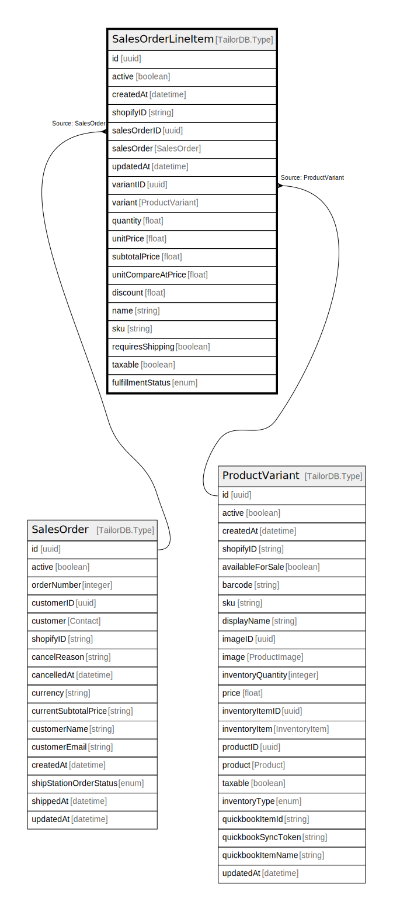

# SalesOrderLineItem

## Description

SalesOrderLineItem model

## Columns

| Name | Type | Default | Nullable | Children | Parents | Comment |
| ---- | ---- | ------- | -------- | -------- | ------- | ------- |
| id | uuid |  | false |  |  |  |
| fulfillmentStatus | enum |  | true |  |  | fulfillmentStatus |
| salesOrderID | uuid |  | true |  | [SalesOrder](SalesOrder.md) | salesOrder ID |
| updatedAt | datetime |  | true |  |  | updatedAt |
| variant | ProductVariant |  | true |  | [ProductVariant](ProductVariant.md) | Variant |
| unitPrice | float |  | true |  |  | unitPrice |
| sku | string |  | true |  |  | sku |
| taxable | boolean |  | true |  |  | taxable |
| active | boolean |  | true |  |  | active |
| createdAt | datetime |  | true |  |  | createdAt |
| variantID | uuid |  | true |  | [ProductVariant](ProductVariant.md) | Variant ID |
| unitCompareAtPrice | float |  | true |  |  | unitCompareAtPrice |
| name | string |  | true |  |  | name |
| shopifyID | string |  | true |  |  | Shopify product ID |
| salesOrder | SalesOrder |  | true |  | [SalesOrder](SalesOrder.md) | SalesOrder model. SalesOrder and this model is n:1. |
| discount | float |  | true |  |  | discount |
| requiresShipping | boolean |  | true |  |  | requiresShipping |
| quantity | float |  | true |  |  | quantity |
| subtotalPrice | float |  | true |  |  | subtotalCost |

## Indexes

| Name | Definition |
| ---- | ---------- |
| Index for updatedAt | Index: true |
| Index for createdAt | Index: true |

## Relations

---

> Generated by [tbls](https://github.com/k1LoW/tbls)
