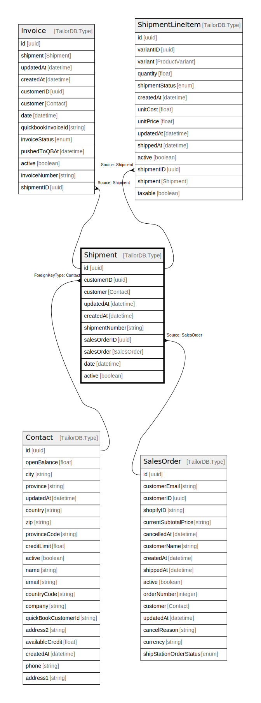

# Shipment

## Description

Shipment model

## Columns

| Name | Type | Default | Nullable | Children | Parents | Comment |
| ---- | ---- | ------- | -------- | -------- | ------- | ------- |
| id | uuid |  | false | [Invoice](Invoice.md) [ShipmentLineItem](ShipmentLineItem.md) |  |  |
| customerID | uuid |  | true |  | [Contact](Contact.md) | Contact ID |
| customer | Contact |  | true |  | [Contact](Contact.md) | Contact model. Contact and this model is n:1 |
| updatedAt | datetime |  | true |  |  | updatedAt |
| createdAt | datetime |  | true |  |  | createdAt |
| shipmentNumber | string |  | true |  |  | Shipment number |
| salesOrderID | uuid |  | true |  | [SalesOrder](SalesOrder.md) | salesOrder ID |
| salesOrder | SalesOrder |  | true |  | [SalesOrder](SalesOrder.md) | SalesOrder model. SalesOrder and this model is n:1. |
| date | datetime |  | true |  |  | date |
| active | boolean |  | true |  |  | active |

## Constraints

| Name | Type | Definition |
| ---- | ---- | ---------- |
| ForeignKey for customer to Contact | FOREIGN KEY | ForeignKeyType: Contact |

## Indexes

| Name | Definition |
| ---- | ---------- |
| Index for updatedAt | Index: true |
| Index for createdAt | Index: true |

## Relations

---

> Generated by [tbls](https://github.com/k1LoW/tbls)
