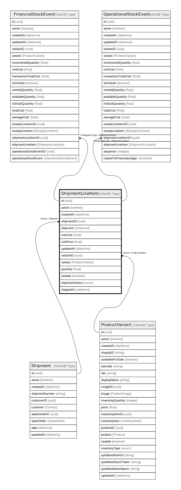

# ShipmentLineItem

## Description

ShipmentLineItem model

## Columns

| Name | Type | Default | Nullable | Children | Parents | Comment |
| ---- | ---- | ------- | -------- | -------- | ------- | ------- |
| id | uuid |  | false | [FinancialStockEvent](FinancialStockEvent.md) [OperationalStockEvent](OperationalStockEvent.md) |  |  |
| variantID | uuid |  | true |  | [ProductVariant](ProductVariant.md) | Variant ID |
| variant | ProductVariant |  | true |  | [ProductVariant](ProductVariant.md) | Variant |
| quantity | float |  | false |  |  | quantity |
| active | boolean |  | true |  |  | active |
| shipment | Shipment |  | true |  | [Shipment](Shipment.md) | Shipment model. Shipment and this model is n:1. |
| unitCost | float |  | false |  |  | unit cost |
| unitPrice | float |  | false |  |  | unit price |
| shipmentStatus | enum |  | true |  |  | inventoryType |
| shippedAt | datetime |  | true |  |  | shipped at |
| createdAt | datetime |  | true |  |  | createdAt |
| shipmentID | uuid |  | false |  | [Shipment](Shipment.md) | Shipment ID |
| updatedAt | datetime |  | true |  |  | updatedAt |
| taxable | boolean |  | true |  |  | taxable |

## Indexes

| Name | Definition |
| ---- | ---------- |
| Index for createdAt | Index: true |
| Index for updatedAt | Index: true |

## Relations

---

> Generated by [tbls](https://github.com/k1LoW/tbls)
