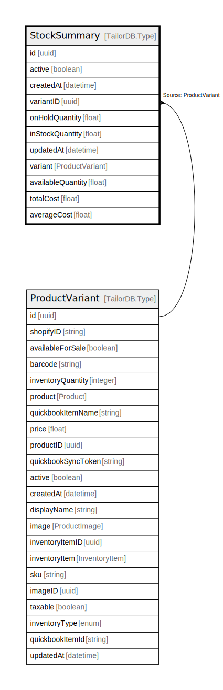

# StockSummary

## Description

StockSummary model

## Columns

| Name | Type | Default | Nullable | Children | Parents | Comment |
| ---- | ---- | ------- | -------- | -------- | ------- | ------- |
| id | uuid |  | false |  |  |  |
| active | boolean |  | true |  |  | active |
| createdAt | datetime |  | true |  |  | createdAt |
| variantID | uuid |  | false |  | [ProductVariant](ProductVariant.md) | Variant ID |
| onHoldQuantity | float |  | false |  |  | onHoldQuantity |
| inStockQuantity | float |  | true |  |  | DO NOT UPDATE FROM THE FRONT END. The quantity of the product in stock. |
| updatedAt | datetime |  | true |  |  | updatedAt |
| variant | ProductVariant |  | true |  | [ProductVariant](ProductVariant.md) | Variant |
| availableQuantity | float |  | false |  |  | availableQuantity |
| totalCost | float |  | false |  |  | totalCost |
| averageCost | float |  | true |  |  | averageCost |

## Indexes

| Name | Definition |
| ---- | ---------- |
| Index for createdAt | Index: true |
| Index for updatedAt | Index: true |

## Relations

---

> Generated by [tbls](https://github.com/k1LoW/tbls)
