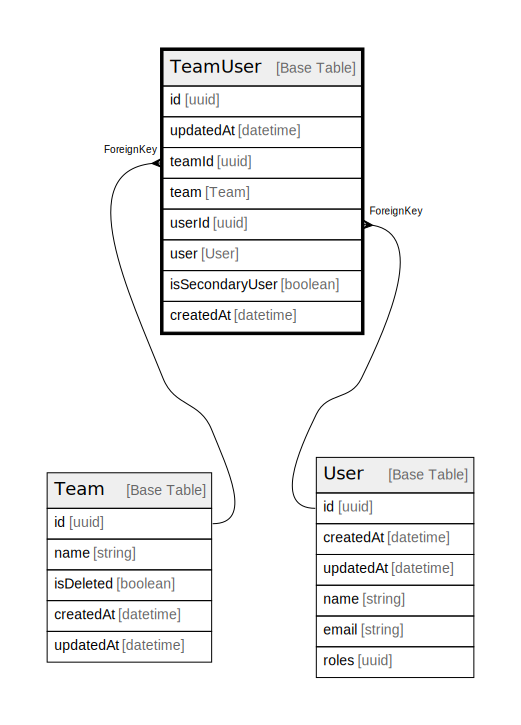

# TeamUser

## Description

TeamUser model

## Columns

| Name | Type | Default | Nullable | Children | Parents | Comment |
| ---- | ---- | ------- | -------- | -------- | ------- | ------- |
| id | uuid |  | false |  |  |  |
| userId | uuid |  | false |  | [User](User.md) | User ID |
| user | User |  | true |  | [User](User.md) | Link to the User |
| isSecondaryUser | boolean |  | false |  |  | Is Secondary User? |
| createdAt | datetime |  | true |  |  | createdAt |
| updatedAt | datetime |  | true |  |  | updatedAt |
| teamId | uuid |  | false |  | [Team](Team.md) | Team ID |
| team | Team |  | true |  | [Team](Team.md) | Link to the Team |

## Constraints

| Name | Type | Definition |
| ---- | ---- | ---------- |
| teamUserCompositeKey | UNIQUE | {"teamUserCompositeKey":{"FieldNames":["teamId","userId"],"Unique":true}} |
| ForeignKey for user to User | FOREIGN KEY | ForeignKeyType: User |
| ForeignKey for team to Team | FOREIGN KEY | ForeignKeyType: Team |

## Indexes

| Name | Definition |
| ---- | ---------- |
| teamUserCompositeKey | {"teamUserCompositeKey":{"FieldNames":["teamId","userId"],"Unique":true}} |
| Index for userId | Index: true |
| Index for createdAt | Index: true |
| Index for updatedAt | Index: true |
| Index for teamId | Index: true |

## Relations

---

> Generated by [tbls](https://github.com/k1LoW/tbls)
