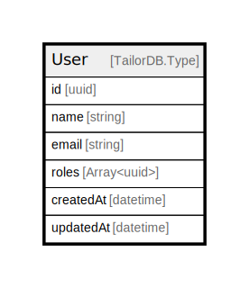

# User

## Description

User of the system

## Columns

| Name | Type | Default | Nullable | Children | Parents | Comment |
| ---- | ---- | ------- | -------- | -------- | ------- | ------- |
| id | uuid |  | false | [Deal](Deal.md) [TeamUser](TeamUser.md) |  |  |
| email | string |  | false |  |  | Email of the user |
| roles | uuid |  | true |  |  | Role IDs of the user |
| createdAt | datetime |  | true |  |  | createdAt |
| updatedAt | datetime |  | true |  |  | updatedAt |
| name | string |  | false |  |  | Name of the user |

## Constraints

| Name | Type | Definition |
| ---- | ---- | ---------- |
| Unique for email | UNIQUE | Unique: true |

## Indexes

| Name | Definition |
| ---- | ---------- |
| Index for email | Index: true |
| Unique for email | Unique: true |
| Index for createdAt | Index: true |
| Index for updatedAt | Index: true |
| Index for name | Index: true |

## Relations

---

> Generated by [tbls](https://github.com/k1LoW/tbls)
